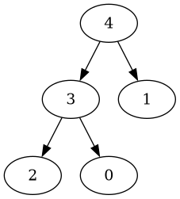
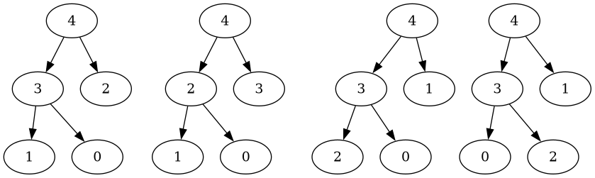
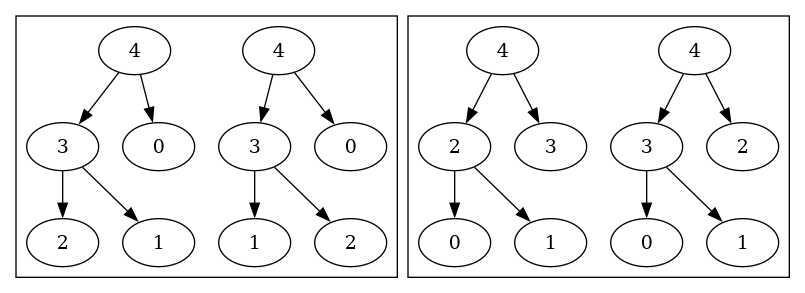

# Daily Coding Problem: Problem #1608 [Medium]

## Problem Statement

This problem was asked by Microsoft.

Write a program to determine how many distinct ways
there are to create a max heap from a list of `N` given integers.

For example,
if `N = 3`,
and our integers are `[1, 2, 3]`,
there are two ways, shown below.

```
  3      3
 / \    / \
1   2  2   1
```
## Analysis

I would not get the Microsoft job.
It took me quite a lot of thinking and drawing heaps as binary trees
to figure out a way to do this, and it's probably not the best way.

I observed that common max-heap implementations use a variable-length array
to keep the elements or nodes or values.
If an element is at index `n` in the array,
its child elements are at indexes `2n+1` and `2n+2`.
Its parent node is at index `(n-1)/2`, which is conveniently rounded down
by ones-complement integer division.

Once you've put elements or values in such a max heap,
you've got an array of integers.
Such an array can be examined to see if it's got the [heap data structure](https://en.wikipedia.org/wiki/Heap_(data_structure))
partial ordering.
Filling in the array backing storage guarantees the "shape" property of
a heap data structure is preserved.

The partial ordering property can be satisfied by some unintuitive binary trees:



The left-hand sub-tree has all elements greater than
the elements of the right-hand sub-tree.
I could not figure out a way to count these without algorithmically checking them,
nor could I figure out some way to "flip" sub-trees to get an arbitrary
heap value arrangement.

I decided to look at all permutations of the list of `N` integers,
running the "is this a heap?" test on each permutation.
Convenient implementations of [Heap's algorithm](https://en.wikipedia.org/wiki/Heap's_algorithm)
for permuting a list of items are recursive.
I took advantage of the [Go]() programming language's easy casual concurrency.
I ran Heap's algorithm in one goroutine,
having code in that goroutine write each permutation to a channel.
The main goroutine reads permutations from the channel,
counting unique permutations.
The problem statement doesn't specify `N` unique integers,
so it's possible that an input would have duplicates.
Two or more "permutations" of the `N` integer list would then be duplicates.

This is a [design pattern](https://bruceediger.com/posts/golang-enabled-pattern/)
that is often useful.
In this case, it divides the work, putting the permutation into one thread,
and unique-detection, counting and output in a second thread.

Here are the 8 ways to arrange values,
when the integer values in the heap are `0, 1, 2, 3, 4`:




I've grouped them to show that there's 4 groups of 2,
related by transposing values of some of the nodes.

### Number of binary max heaps as a sequence of integers

The [Online Encyclopedia of Integer Sequences]() contains sequence
[A056971, Number of (binary) heaps on n elements](https://oeis.org/A056971).

I implemented [Wolfram MathWorld's](https://mathworld.wolfram.com/Heap.html)
recursive function to find the count of heaps of `N` unique integers.

[Code here](cmd/algheapcounter.go).

I have no idea how one would go about deriving the recursive function.

### Code

I wrote a quick and dirty [heap implementation](heap) to understand things, 
I cribbed most of the code from a "heap sort" [linked list](https://github.com/bediger4000/linked_lists)
sorting algorithm, which was in turn transliterated from a C heap sort
algorithm I wrote after receiving enlightenment about heaps.
The point of this is to try inserting integers into a genuine heap
to see if particular configurations can be achieved.

Programs that use parts of `package heap`, or that I used to understand this problem:

* [example heap sort](cmd/heapdemo.go), to verify quick-and-dirty heap implementation
  - `go build cmd/heapdemo.go; ./heapdemo 5 2 1 0 3 4`
* [heap visualization](cmd/heapviz.go) using [GraphViz](https://graphviz.org/)
  - `go build cmd/heapviz.go; ./heapviz 5 2 1 0 3 4 > h.dot; dot -Tpng -o h.png h.dot;`
  - Then view PNG file `h.png`
* [test heap construction](cmd/buildcheck.go) and show backing storage on command line
  - `go build cmd/buildcheck.go; ./buildcheck 4 0 2 1 3 5`
* [try "is heap" test](cmd/arraycheck.go) on arbitrary arrays
  - `go build cmd/arraycheck.go; ./arraycheck 3 2 1; ./arraycheck 1 2 3`
  - My implementation of the problem's solution uses Go slices as heap structure backing storage,
  this program can give negative answers, where `buildcheck` should only give positive answers.
* [try Heap's algorithm](cmd/permutations.go) on integers from the command line
  - `go build cmd/permutations.go; ./permutations 1 2 3`
  - `go build cmd/permutations.go; ./permutations 1 2 3 4 5 | sort | uniq | wc -l`
    * Should get N! (N factorial), if all integers on command line are unique
  - If you input duplicate integers, you get a few non-unique permutations
* [Count unique heaps](heapcount.go) of a list of arbitrary integers.
  This actually implements the solution to the problem statement.

## Interview Analysis

I'm not sure what this question is after.
It could be a question to help the interviewer decide if a candidate
has a grasp of algorithms.
At the very least, the candidate would have to know of and understand heaps
(and inside that, binary trees).
My implementation of this problem (which may not be the best!) required
knowing how to permute N integers,
and knowing enough about heap properties and implementations to use a Go slice
as the underlying data storage.
Solving the problem doesn't require more than a rudimentary knowledge of
the definition of the heap data structure.

The recursive function that gives a count of heaps constructible
from a list of unique integers is far too obscure to expect even a specialist
to have memorized,
so this problem can't be a test of whether someone just happens to know that
function.
The function's very existence almost negates this as a programming problem,
unless the point is to see the candidate fail by not asking if the list
of integers can contain dupes.

The problem as I solved it seems large for a whiteboard interview.
I suppose the candidate could block it out on a whiteboard,
with "TBD" or just a sketch of the code in functions for permutations
and heap-ordering-checking.

It's definitely more than a "[Medium]",
either in terms of knowing some obscure combinatorial recursive function,
and having the ability to write a program to calculate it,
or in knowing enough idioms and generally useful easy data structures
and design patterns to write something like I did.
